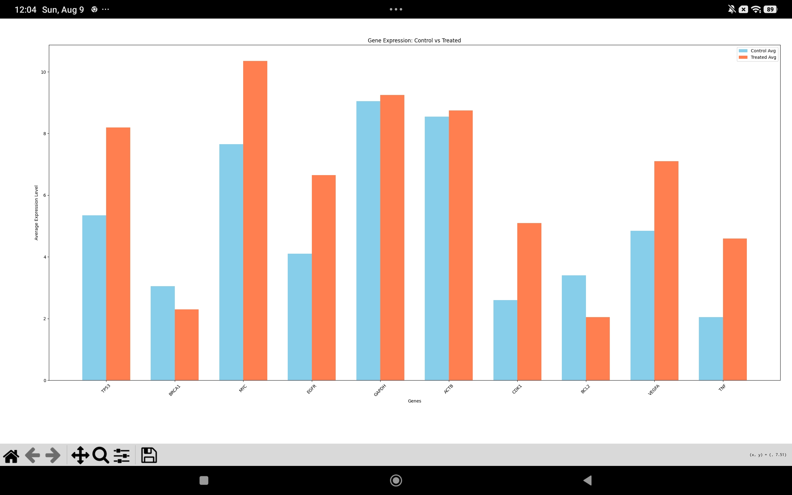

# Gene Expression Analysis

## What This Code Does
This Python script compares gene levels between healthy cells and diseased cells to see which genes are different.

## How to Run It
Run the script in your terminal using:

```bash
python newfile.py
```
## Output



